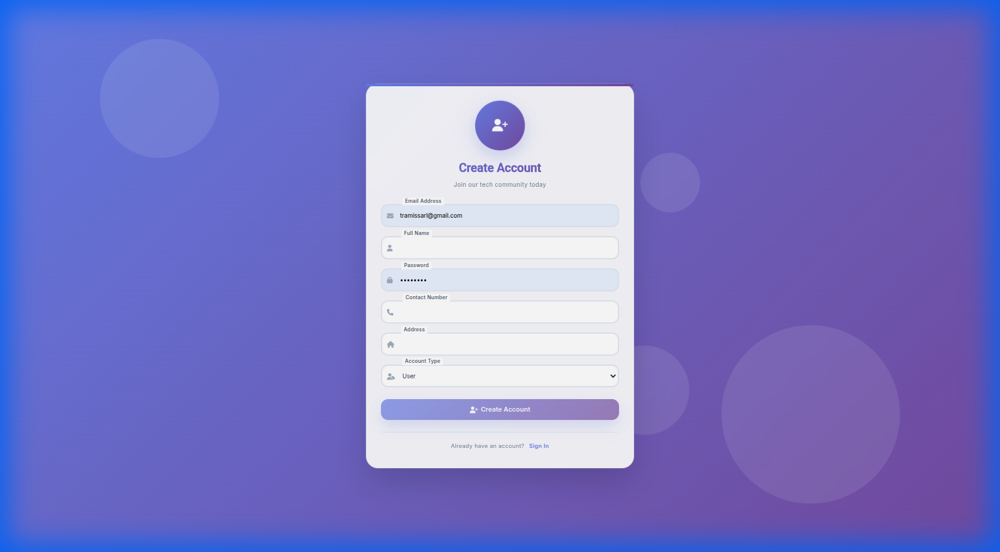
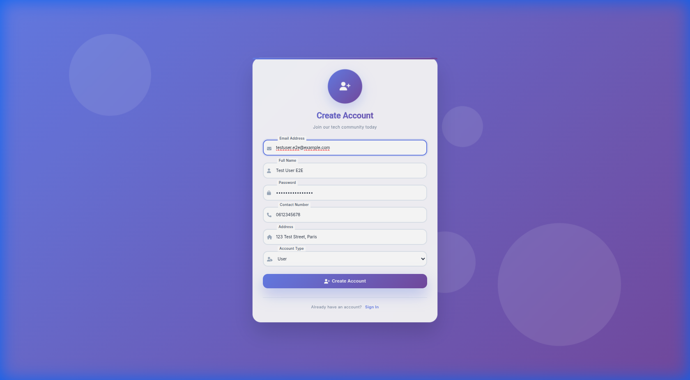
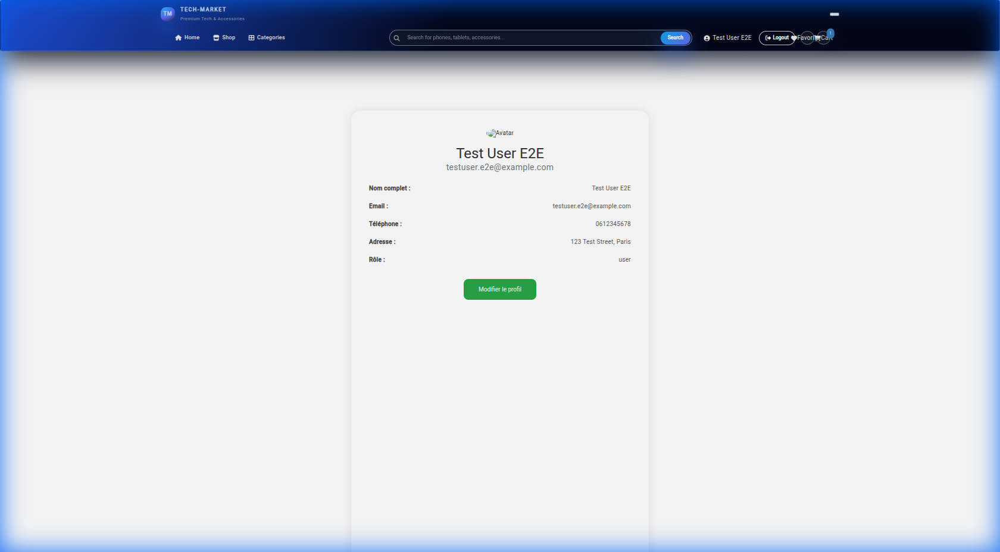
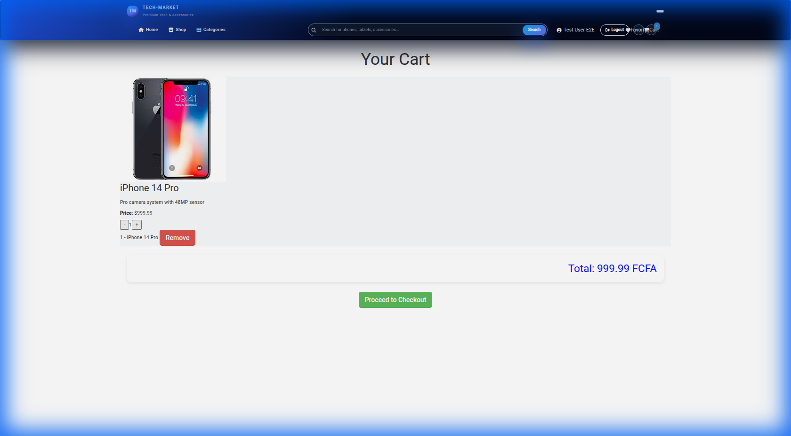
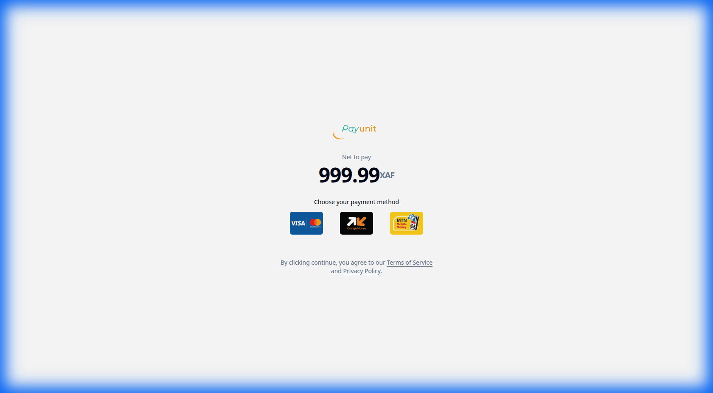

# 📚 Manuel d'Utilisation - Theck Market

## Application E-Commerce Full Stack

**Version:** 1.0  
**Date:** 29 Décembre 2025  
**Auteur:** Christian (Développeur Full Stack)

---

## 📋 Table des Matières

1. [Introduction](#1-introduction)
2. [Accès à l'application](#2-accès-à-lapplication)
3. [Guide Utilisateur](#3-guide-utilisateur)
   - [Inscription](#31-inscription)
   - [Connexion](#32-connexion)
   - [Navigation dans les produits](#33-navigation-dans-les-produits)
   - [Gestion du panier](#34-gestion-du-panier)
   - [Processus de paiement](#35-processus-de-paiement)
   - [Suivi des commandes](#36-suivi-des-commandes)
4. [Guide Administrateur](#4-guide-administrateur)
   - [Accès au Dashboard](#41-accès-au-dashboard)
   - [Gestion des utilisateurs](#42-gestion-des-utilisateurs)
   - [Gestion des produits](#43-gestion-des-produits)
   - [Gestion des commandes](#44-gestion-des-commandes)
   - [Visualisation des transactions](#45-visualisation-des-transactions)
   - [Exports CSV](#46-exports-csv)
5. [Fonctionnalités Avancées](#5-fonctionnalités-avancées)
6. [Sécurité](#6-sécurité)
7. [Support](#7-support)

---

## 1. Introduction

**Theck Market** est une application e-commerce moderne permettant :

- 🛒 L'achat de produits en ligne (smartphones, accessoires, etc.)
- 💳 Le paiement sécurisé via PayUnit
- 📦 Le suivi des commandes avec QR code
- 🎛️ Un dashboard administrateur complet

### Technologies utilisées

| Composant | Technologie |
|-----------|-------------|
| **Frontend** | Angular 18 |
| **Backend** | Flask (Python) |
| **Base de données** | SQLite / PostgreSQL |
| **Paiement** | PayUnit API |
| **Hébergement** | Vercel (frontend) + Render (backend) |

---

## 2. Accès à l'application

### URLs

| Environnement | URL |
|---------------|-----|
| **Staging** | https://staging-market.vercel.app |
| **API Backend** | https://theck-market.onrender.com |

### Configuration requise

- Navigateur moderne (Chrome, Firefox, Safari, Edge)
- Connexion internet stable
- JavaScript activé

---

## 3. Guide Utilisateur

### 3.1 Inscription

Pour créer un compte sur Theck Market :

1. Accédez à la page d'inscription : `/register`
2. Remplissez le formulaire avec vos informations :
   - **Nom complet**
   - **Email**
   - **Mot de passe**
   - **Numéro de téléphone**
   - **Adresse de livraison**


*Figure 1: Formulaire d'inscription*

3. Cliquez sur **"S'inscrire"**
4. Vous recevrez un email de bienvenue
5. Vous êtes automatiquement connecté et redirigé vers votre profil


*Figure 2: Inscription réussie*

### 3.2 Connexion

Si vous avez déjà un compte :

1. Accédez à la page de connexion : `/login`
2. Entrez votre **email** et **mot de passe**
3. Cliquez sur **"Se connecter"**


*Figure 3: Page profil après connexion*

### 3.3 Navigation dans les produits

Après connexion, vous pouvez parcourir notre catalogue :

1. Cliquez sur **"Shop"** dans la barre de navigation
2. Parcourez les produits disponibles
3. Utilisez les filtres pour affiner votre recherche


*Figure 4: Catalogue des produits*

### 3.4 Gestion du panier

Pour ajouter des produits à votre panier :

1. Sur la page produit, cliquez sur **"Ajouter au panier"**
2. Le compteur du panier se met à jour dans la navbar
3. Cliquez sur l'icône 🛒 pour accéder à votre panier


*Figure 5: Panier avec produits*

Dans le panier, vous pouvez :
- ➕ Augmenter la quantité
- ➖ Diminuer la quantité
- 🗑️ Supprimer un article
- Voir le **total** de votre commande

### 3.5 Processus de paiement

Pour finaliser votre commande :

1. Dans le panier, cliquez sur **"Proceed to Checkout"**
2. Vous êtes redirigé vers la page de paiement PayUnit
3. Choisissez votre méthode de paiement :
   - Mobile Money (Orange, MTN, etc.)
   - Carte bancaire
4. Confirmez le paiement


*Figure 6: Redirection vers PayUnit pour le paiement*

### 3.6 Suivi des commandes

Après le paiement :

1. Accédez à **"Mes commandes"** dans votre profil
2. Vous pouvez voir :
   - Le statut de chaque commande
   - Les détails des produits
   - Le QR code de livraison
3. Présentez le **QR code** au livreur pour confirmer la réception

---

## 4. Guide Administrateur

### 4.1 Accès au Dashboard

Pour accéder au dashboard administrateur :

1. Connectez-vous avec un compte **admin**
2. Cliquez sur **"Admin"** dans la navbar
3. Ou accédez directement à : `/admin`

> ⚠️ **Note:** Seuls les utilisateurs avec le rôle `admin` peuvent accéder à cette section.

### 4.2 Gestion des utilisateurs

Dans la section **Utilisateurs** (`/admin/users`) :

| Action | Description |
|--------|-------------|
| **Voir** | Consulter les détails d'un utilisateur |
| **Modifier** | Changer le rôle (user ↔ admin) ou activer/désactiver |
| **Supprimer** | Supprimer un compte utilisateur |
| **Recherche** | Trouver un utilisateur par nom ou email |
| **Filtrer** | Filtrer par rôle (admin, user) |

#### Promouvoir un utilisateur en admin

1. Cliquez sur ✏️ **Modifier** à côté de l'utilisateur
2. Dans la modal, cliquez sur **👑 Administrateur**
3. L'utilisateur peut maintenant accéder au dashboard admin

### 4.3 Gestion des produits

Dans la section **Produits** (`/admin/products`) :

- ➕ **Ajouter** un nouveau produit
- ✏️ **Modifier** les informations (nom, prix, stock, description)
- 🗑️ **Supprimer** un produit
- 📷 **Uploader** des images via Cloudinary

### 4.4 Gestion des commandes

Dans la section **Commandes** (`/admin/orders`) :

| Statut | Couleur | Description |
|--------|---------|-------------|
| `pending` | 🟡 Jaune | En attente de traitement |
| `confirmed` | 🔵 Bleu | Confirmée, en préparation |
| `shipped` | 🟣 Violet | Expédiée |
| `delivered` | 🟢 Vert | Livrée |
| `cancelled` | 🔴 Rouge | Annulée |

Actions disponibles :
- Changer le statut d'une commande
- Voir les détails (produits, client, adresse)
- Annuler une commande

### 4.5 Visualisation des transactions

Dans la section **Transactions** (`/admin/transactions`) :

- Liste de toutes les transactions PayUnit
- Détails : ID, montant, statut, date
- Recherche par ID de transaction

### 4.6 Exports CSV

Le dashboard permet d'exporter les données en CSV :

| Export | Fichier généré |
|--------|----------------|
| **Utilisateurs** | `users_export.csv` |
| **Commandes** | `orders_export.csv` |
| **Transactions** | `transactions_export.csv` |

Pour exporter :
1. Allez sur le dashboard (`/admin`)
2. Dans la section **"Exporter les données"**
3. Cliquez sur le bouton correspondant

---

## 5. Fonctionnalités Avancées

### 📊 Graphiques du Dashboard

Le dashboard affiche des graphiques en temps réel :

- **Commandes par statut** : Répartition visuelle
- **Top 5 produits** : Produits les plus vendus
- **Utilisateurs par rôle** : Admin vs Users
- **Revenus 30 jours** : Évolution des revenus

### 🔔 Notifications

Le système génère automatiquement des alertes :

| Alerte | Priorité |
|--------|----------|
| ⚠️ Stock faible (< 10 unités) | Haute |
| 🛒 Commandes en attente | Moyenne |
| 👥 Nouveaux utilisateurs | Basse |
| ❌ Transactions échouées | Haute |
| 💰 Revenus du jour | Basse |

### 📦 QR Code de livraison

Chaque commande génère un **QR code sécurisé** contenant :
- ID de transaction
- Montant
- Référence commande
- Signature HMAC (anti-fraude)

Le livreur scanne le QR pour valider la livraison.

---

## 6. Sécurité

### 🔐 Authentification

- Tokens **JWT** avec expiration
- Hachage des mots de passe (**bcrypt**)
- Protection CORS configurée

### 🛡️ Protection des routes

| Route | Protection |
|-------|------------|
| `/customer/*` | Token JWT requis |
| `/admin/*` | Token JWT + rôle admin |
| Publiques | Aucune (login, register) |

### 📧 Rate Limiting

| Endpoint | Limite |
|----------|--------|
| `/register` | 20/heure |
| `/login` | 5/minute |
| `/forgot-password` | 3/heure |

### ⚙️ Variables d'environnement

Pour la production, configurez :

```env
SECRET_KEY=votre-cle-secrete
QR_SECRET_KEY=cle-pour-signature-qr
DISABLE_MIGRATIONS=true
MAIL_SERVER=smtp.gmail.com
MAIL_PORT=587
MAIL_USERNAME=email@example.com
MAIL_PASSWORD=mot-de-passe-app
```

---

## 7. Support

### Contact

Pour toute question ou problème :

- 📧 **Email:** support@theckmarket.com
- 📱 **Téléphone:** +237 6XX XXX XXX

### FAQ

**Q: J'ai oublié mon mot de passe**  
R: Cliquez sur "Mot de passe oublié" sur la page de connexion.

**Q: Mon paiement a échoué**  
R: Vérifiez votre solde et réessayez. Si le problème persiste, contactez le support.

**Q: Comment devenir administrateur ?**  
R: Contactez un administrateur existant pour qu'il vous attribue les droits.

---

## 📹 Vidéos de démonstration

Les vidéos suivantes montrent les workflows de l'application :

| Vidéo | Description | Fichier |
|-------|-------------|---------|
| **Inscription** | Processus complet d'inscription | `e2e_registration_test.webp` |
| **Connexion** | Test de connexion automatique | `e2e_login_test_1767023479752.webp` |
| **Panier & Checkout** | Ajout panier et paiement | `e2e_cart_checkout_1767023576014.webp` |

> 💡 Les fichiers `.webp` sont des animations qui peuvent être ouvertes dans un navigateur.

---

## 📸 Galerie des captures d'écran

| Capture | Description |
|---------|-------------|
| `register_form.png` | Formulaire d'inscription |
| `registration_result.png` | Résultat après inscription |
| `login_success_profile.png` | Profil utilisateur |
| `products_page.png` | Catalogue produits |
| `cart_page.png` | Panier avec articles |
| `checkout_result.png` | Page de paiement PayUnit |

---

## 📝 Changelog

### Version 1.0 (29/12/2025)
- ✅ Inscription et connexion utilisateur
- ✅ Catalogue produits avec panier
- ✅ Paiement PayUnit intégré
- ✅ Dashboard administrateur complet
- ✅ Exports CSV
- ✅ Graphiques et notifications
- ✅ QR Code sécurisé pour livraison
- ✅ Emails transactionnels

---

**© 2025 Theck Market - Tous droits réservés**
